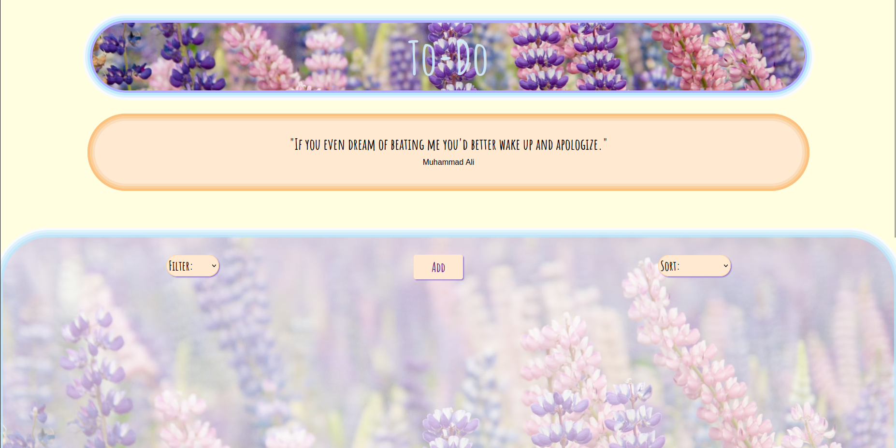
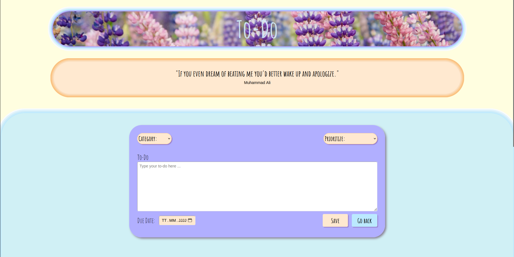
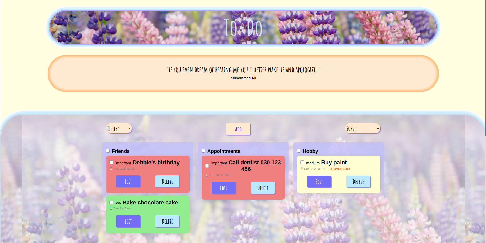
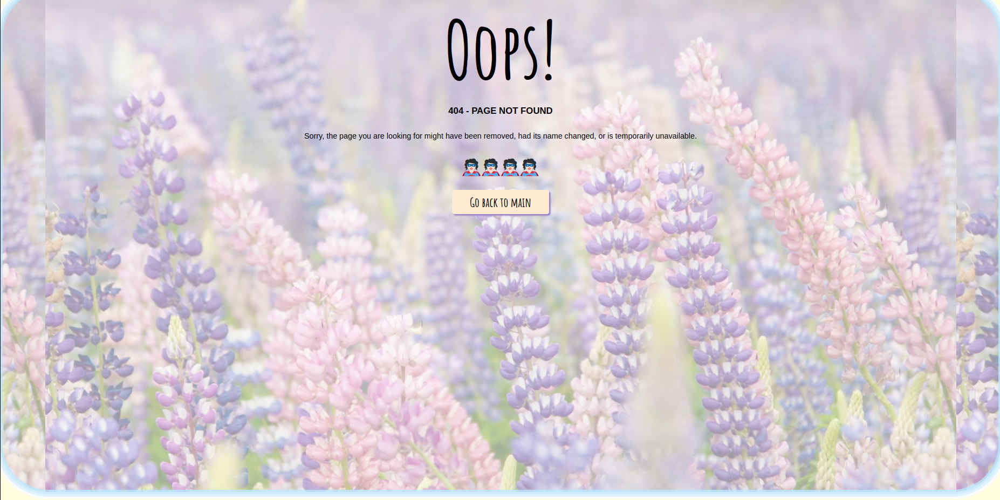

# 'TO DO' App Project
This project was a group project at the end of the ‘Single Page Application’ module in my further training at the DCI. 
Our group consisted of three people. Our group presents an App of To-Do Tasks with some additional features that are not usually inplemented in mobile versions of such sort of apps. The choice was made on basis of the time frame for creating the code, solving issues of combining data from different branches, proper styling and finally deployment of the project on render:
  
Link to app: <a href="https://project-to-do-list-u8kr.onrender.com">To-Do-App</a>

  
Contents: 🔽

- [TO DO App Project](#to-do-app-project)
- [Built With](#built-with)
- [Getting Started](#getting-started)
- [Workflow](#workflow)
- [Usage](#usage)
- [Screenshots](#screenshots)
- [Contact (alphabetical order)](#contact)

### Built With

🔹
 
🔹
 
🔹
 
🔹
 
🔹

## Getting Started
Work starts with an idea of which App we want to create. Then with the sketch in Excalidraw we create the structure of our App.

The next step is to assign tasks for every group-member based on quantity of components and complexity of project's functionality. For that purpose we choose Jira.
We also assign responsible manager for GitHub for creating the repo, branches, etc. And team-Lead for time-management and organisational matters.

Taking into consideration requirements:

  - multiple pages components (react-router-dom, preferably also sending params from one page to another)
  - nested components (preferably sending props from one to another at least once)
  - use 3rd party API to fetch some data (get request) like: weather API, recipes API...
  - deploy on render
  - extra: one global state (useContext)
  - extra: useReducer

following steps are:

  * Picking colour scheme: #FFE9D0, #FFFED3, #FFD0D0, #BBE9FF, #B1AFFF
  * Creating 2 main and 9 subordinate components (routing and linking them)
  * Creating individul css file for each component. Handful approach for our project.
  * Nested components are imported and data is shared with useState hook
  * Using 3rd party API to fetch data for inspirational quotes
  * Deploying on render
  * extra: one global state (useContext) is highly in use

[🔼 Back to top](#to-do-app-project)
 
## Workflow 
Important daily procedure is to push, pull and merge branches for solving small portions of conflicts. Tracking daily updates to continue coding with up-to-date information. Also live communication to discuss following steps and required changes is a good practice for smooth workflow.

🔹To push your changes and get updated code from main to continue working:

- Work in your branch  
- Push changes to your branch occassionally!  
- At EOD, merge your changes to main after taking a pull from main  
- Once your changes are merged to main, inform Github manager  
- After Github manager's successfully merging of all changes (Conflict resolution), come back in your branch  
- Make sure you do the following:  
   - git checkout main  
   - git pull  
   - git checkout "your branch"  
   - git merge main  
- VOILA! Now your code is UP-TO-DATE!  

! After getting the code from main, if you get conflicts, resolve it and push again and if any error occures:

git push -f -u origin branchName

[🔼 Back to top](#to-do-app-project)

## Usage
At first glance at our TO-DO App, it welcomes you with random phrase of wisdom or inspiration and surprises with animated logo. 

Button "Add" opens for you the form to create your to-do, choosing (or not) priority, category and due date. Although writing the text of your task is mandatory if you want it to be created. 
Also you can use "Go back" button if you change your mind.

For the list of your tasks, which are presented as colorful cards divided (or not) into various groups, you are welcome to "Sort" them according to the level of priority (important, medium, low) and date of creation (new, old). And "Filter" option will show you all, completed and pending tasks. 
When "Due date" is assigned, you will get a warning sign of "Due Soon or Overdue" just to remind about your task's deadline.
You can also edit your tasks and due date. You can check the tasks and mark as completed or if the task is no longer needed,you can "DELETE" the task.
For more convenience if the list of tasks is long, "Go up" button is at your service.

Finally, the footer will recover the contact information of our project-members.

We appreciate your time to discover the result of our work and trust in our skills and creativity!

[🔼 Back to top](#to-do-app-project)

## Screenshots

Landing page
  

Adding task
  

Landing page with tasks
  

 
Not found page
  

 
Mobile Version

 

[🔼 Back to top](#to-do-app-project)

## Contact 
(alphabetical order)

<b>Divya Mariya Raphy</b>
 
Mail: divya.raphy@dci-student.org
 
Github-Link: <a href="https://github.com/divyasheen">Divyasheen</a>
  

<b>Nataliia Lishchynska</b>
 
Mail: -
 
Github-Link: <a href="https://github.com/NATZEN24">NATZEN24</a>
  

<b>Judith Bohmann</b>
 
Mail: ju.bohmann@gmx.de
 
Github-Link: <a href="https://github.com/You-Did-Bowman">You-Did-Bowman</a>
  

